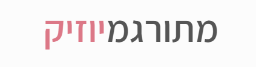

<!-- markdownlint-disable-next-line -->

<h3 align="center"></h3>

<!-- Todo built in react + node + mui chips? or in footer?  -->
<!-- Todo why is there 3 dashes when pushing? check if happen in he spicify items: -->
<!-- 

  
  
  
  
  

 -->

    
    <a href="https://instagram.com/meturgamusic">
        100%20followers-E4405F?logo=instagram&logoColor=white" alt="Instagram">
    </a>
    
    
    
    

---

The website for Israeli English learners to learn English from songs.

### Features

- Get English songs Translated to hebrew line after line,
 without loosing the source language
- Save words, song lyrics, and practice English in a fun way
- Search in milions of songs on the web
- Get dictionary translation for every single word
- Save new words for practicing
- Built-in Music player

### Example Songs

- [Sabrina Carpenter - Espresso](https://meturgamusic.com/songs/Sabrina-Carpenter_Espresso)
- [Eden Golan - Hurricane](https://meturgamusic.com/songs/Eden-Golan_Hurricane)
- [Maroon 5 - Memories](https://meturgamusic.com/songs/maroon-5_memories)

### Some of the sources

Translation provided by [Google cloud translate](https://cloud.google.com/translate), and by [Azure AI translator](https://learn.microsoft.com/en-us/azure/ai-services/translator/overview).