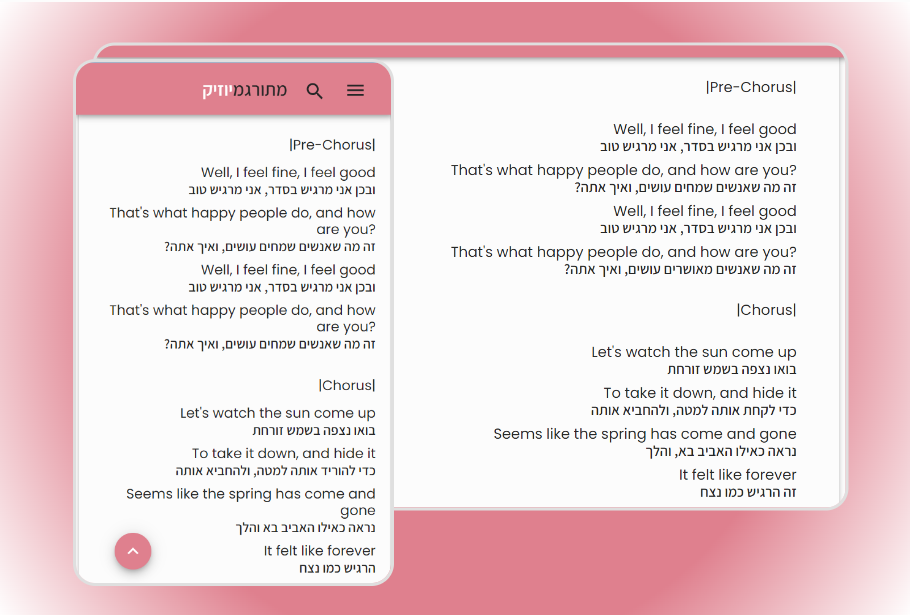

<!-- markdownlint-disable-next-line -->

<h1 align="center">MeturgaMusic</h1>

 
 

## Automatic EN-HE songs translator For English learners     
 ### Get English songs Translated to hebrew line after line, without loosing the source language
 ### Save words, songs, and practice English in a fun way

  
  

 
  
  

 ### Get dictionary translation for every single word
 
   
  

 ### Save new words for practice
 
 
  

 ### Built-in Music player
 
 
  

 ### Search in milions of songs on the web
  
 